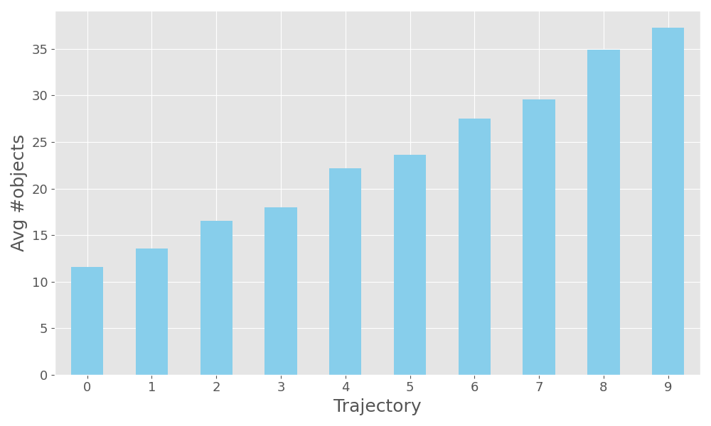
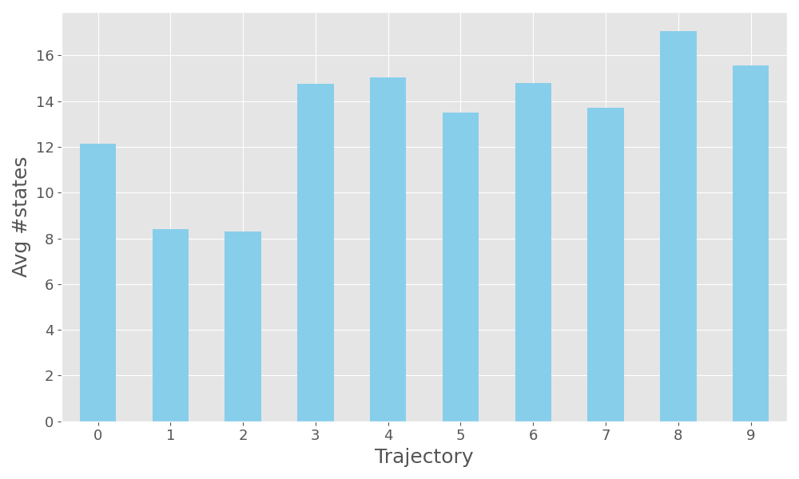

# Action Model Learning Benchmarking
<!-- Define badges -->
<div style="display: flex; gap: 10px;">
   
  <a href="https://opensource.org/licenses/MIT" target="_blank">
    </a>

</div>

Official code for benchmark generation and evaluation of action model learning approaches.


## Benchmark generation
The following instructions have been tested on macOS Sequoia 15.3


1. Clone [`pddl-generators` repository](https://github.com/AI-Planning/pddl-generators) into `util` directory:
```
 cd util && git clone https://github.com/AI-Planning/pddl-generators
```

2. Build all PDDL generators:
```
cd pddl-generators && ./build_all
```

3. Move the `matchingbw` generator out of `blocksworld` for the trajectory 
generator to work correctly
```
mv blocksworld/matching matchingbw
cp -r blocksworld/bwstates.1 ./
```

4. Install `requirements.txt`
```
cd ../../ && pip install -r requirements.txt
```
5. Generate trajectories:
```
cd util && python generators.py
```

6. Optionally generate trajectory statistics and plots:
```
python stats.py
```


> [!warning]
> Urgent info that needs immediate user attention to avoid problems.

## Domain selection
The selected domains are the ones adopted in previous IPC learning tracks:
1. [IPC 2008 Learning Track](https://ipc08.icaps-conference.org/learning/): `goldminer`, `matchingbw`, `npuzzle`, 
`parking` and `sokoban`
> [!WARNING]
> `thoughtful`: has not been considered since there is no problem generator neither in the IPC 
> resources nor in [`pddl-generators` repository](https://github.com/AI-Planning/pddl-generators).

2. [IPC 2011 Learning Track](https://icaps11.icaps-conference.org/proceedings/pal/fawcett-et-al.pdf): `barman`, 
`blocksworld`, `depots`, `gripper`, `parking`, `rovers`, `satellite`, `spanner` and `tpp`.
3. [IPC 2014 Learning Track](https://ojs.aaai.org/aimagazine/index.php/aimagazine/article/view/2571): `elevators`,
`floortile`, `nomystery`, `parking`, `spanner` and `transport`.
4. [IPC 2023 Learning Track](https://github.com/ipc2023-learning/benchmarks): `blocksworld`,
`childsnack`, `ferry`, `floortile`, `miconic`, `rovers`, `satellite`, `sokoban`,
`spanner` and `transport`.
> [!WARNING]
> `childsnack`: for consistency with other domains, we adopted the original domain version 
>  without negative preconditions.

Therefore the following set of 20 classical planning domains:


<table class="dataframe">
  <thead>
<tr style="text-align: left;">
  <th rowspan="2">Domain name</th>
  <th rowspan="2">Operators</th>
  <th rowspan="2">Predicates</th>
  <th rowspan="2">Types</th>
  <th colspan="2">Max arity</th>
  <th colspan="2">Min arity</th>
</tr>
<tr>
  <th>Operators</th>
  <th>Predicates</th>
  <th>Operators</th>
  <th>Predicates</th>
</tr>
  </thead>
  <tbody>
    <tr>
      <td>barman</td>
      <td>12</td>
      <td>15</td>
      <td>9</td>
      <td>6</td>
      <td>2</td>
      <td>2</td>
      <td>1</td>
    </tr>
    <tr>
      <td>blocksworld</td>
      <td>4</td>
      <td>5</td>
      <td>1</td>
      <td>2</td>
      <td>2</td>
      <td>1</td>
      <td>0</td>
    </tr>
    <tr>
      <td>childsnack</td>
      <td>6</td>
      <td>13</td>
      <td>6</td>
      <td>4</td>
      <td>2</td>
      <td>2</td>
      <td>1</td>
    </tr>
    <tr>
      <td>depots</td>
      <td>5</td>
      <td>6</td>
      <td>9</td>
      <td>4</td>
      <td>2</td>
      <td>3</td>
      <td>1</td>
    </tr>
    <tr>
      <td>elevators</td>
      <td>6</td>
      <td>8</td>
      <td>5</td>
      <td>5</td>
      <td>2</td>
      <td>3</td>
      <td>2</td>
    </tr>
    <tr>
      <td>ferry</td>
      <td>3</td>
      <td>5</td>
      <td>2</td>
      <td>2</td>
      <td>2</td>
      <td>2</td>
      <td>0</td>
    </tr>
    <tr>
      <td>floortile</td>
      <td>7</td>
      <td>10</td>
      <td>3</td>
      <td>4</td>
      <td>2</td>
      <td>3</td>
      <td>1</td>
    </tr>
    <tr>
      <td>goldminer</td>
      <td>7</td>
      <td>12</td>
      <td>1</td>
      <td>2</td>
      <td>2</td>
      <td>1</td>
      <td>0</td>
    </tr>
    <tr>
      <td>grippers</td>
      <td>3</td>
      <td>4</td>
      <td>4</td>
      <td>4</td>
      <td>3</td>
      <td>3</td>
      <td>2</td>
    </tr>
    <tr>
      <td>matchingbw</td>
      <td>10</td>
      <td>10</td>
      <td>2</td>
      <td>3</td>
      <td>2</td>
      <td>2</td>
      <td>1</td>
    </tr>
    <tr>
      <td>miconic</td>
      <td>4</td>
      <td>6</td>
      <td>2</td>
      <td>2</td>
      <td>2</td>
      <td>2</td>
      <td>1</td>
    </tr>
    <tr>
      <td>nomystery</td>
      <td>3</td>
      <td>6</td>
      <td>5</td>
      <td>6</td>
      <td>3</td>
      <td>3</td>
      <td>2</td>
    </tr>
    <tr>
      <td>npuzzle</td>
      <td>1</td>
      <td>3</td>
      <td>2</td>
      <td>3</td>
      <td>2</td>
      <td>3</td>
      <td>1</td>
    </tr>
    <tr>
      <td>parking</td>
      <td>4</td>
      <td>5</td>
      <td>2</td>
      <td>3</td>
      <td>2</td>
      <td>3</td>
      <td>1</td>
    </tr>
    <tr>
      <td>rovers</td>
      <td>9</td>
      <td>25</td>
      <td>7</td>
      <td>6</td>
      <td>3</td>
      <td>2</td>
      <td>1</td>
    </tr>
    <tr>
      <td>satellite</td>
      <td>5</td>
      <td>8</td>
      <td>4</td>
      <td>4</td>
      <td>2</td>
      <td>2</td>
      <td>1</td>
    </tr>
    <tr>
      <td>sokoban</td>
      <td>2</td>
      <td>4</td>
      <td>3</td>
      <td>5</td>
      <td>3</td>
      <td>3</td>
      <td>1</td>
    </tr>
    <tr>
      <td>spanner</td>
      <td>3</td>
      <td>6</td>
      <td>5</td>
      <td>4</td>
      <td>2</td>
      <td>3</td>
      <td>1</td>
    </tr>
    <tr>
      <td>tpp</td>
      <td>4</td>
      <td>7</td>
      <td>7</td>
      <td>7</td>
      <td>3</td>
      <td>3</td>
      <td>2</td>
    </tr>
    <tr>
      <td>transport</td>
      <td>3</td>
      <td>5</td>
      <td>6</td>
      <td>5</td>
      <td>2</td>
      <td>3</td>
      <td>2</td>
    </tr>
  </tbody>
</table>


## Trajectory features
1. **Reproducibility**: the trajectory generation process is fully reproducible and can be randomized according to 
a random seed.
2. **Bias mitigation**: the bias in the initial and final states of every trajectory is mitigated by: 
   1. planning to reach a random goal from a random initial state; 
   2. executing the plan by interleaving random actions according to some probability (set to `0.2`); the random
   actions are selected such that the problem remains feasible, and after executing a random action a new plan is produced.
   3. randomly selecting a subtrajectory from the ones generated in the two previous steps.
3. **Variability**: in terms of trajectory length (ranging from `5` to `30`) and number of problem objects.

<div align="center">
  <a href="benchmarks/objects.png">
    
  </a>
  <a href="benchmarks/states.png">
    
  </a>
</div>